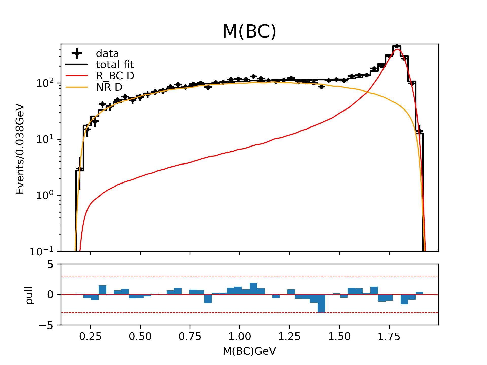
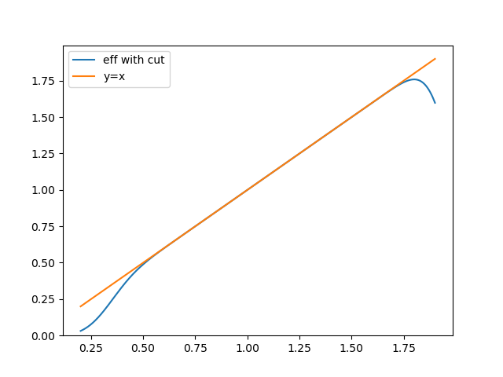
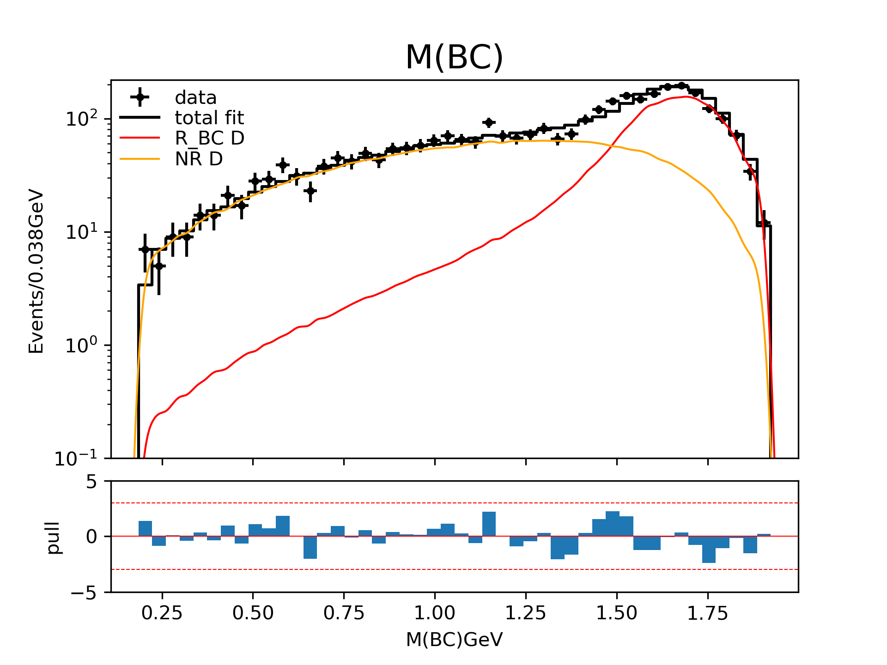
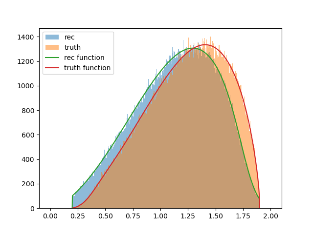
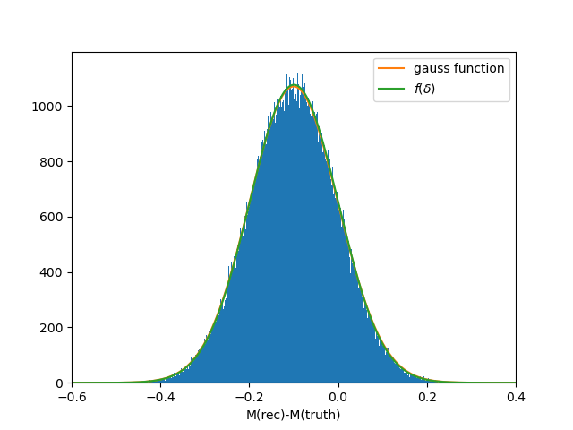
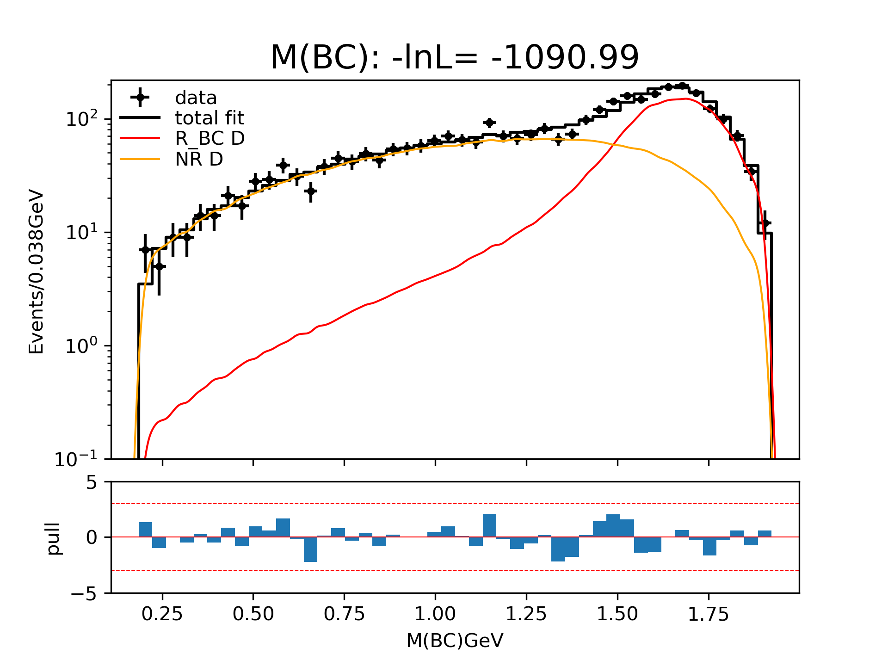

# Example of a full amplitude fit with resolution

# 1. gen_toy.py

Generate toy data and flat phase space sample. The toy model include a simple
BW state and a NR state.

$$ A \rightarrow (BC) + D, (BC)\rightarrow B + C $$

This is the toy distribution. 

# 2. detector.py

The detector model, the reconstructed value is the truch value plus a gauss
random number.

$$ m' = m + \delta ,\ \delta \sim \frac{1}{\sqrt{2\pi}\sigma} \exp(-\frac{(\delta-\mu)^2}{2\sigma^2})$$

There ia also a simple linear efficency with a mass range cut for reconstucted
value.

$$ \epsilon(m, m') = m \theta(m'-m_{min}) \theta(m_{max}-m') ,$$

$\theta(x)$ is the step function.

This is the shape of efficency.

This is the distribution with the detector effect.

# 3. plot_function.py

Analytical form of truth and reconstructed value distribution.

The function of detector.py is such transition funtion.

$$ T(m, m') = \frac{1}{\sqrt{2\pi}\sigma}\exp(-\frac{(m'-m-\mu)^2}{2\sigma^2}) \epsilon(m, m') \rho(m) .$$

$\rho(m)=pq$ is the phase space factor, $p$, $q$ is the breakup monmentum of
$A\rightarrow (BC) + D$ and $(BC) \rightarrow B + C$.

The projections of the truth and reconstucted value distrubution are

$$ f_{truth}(m) = \int T(m, m') dm',$$

$$ f_{rec}(m') = \int T(m, m') dm,$$

and

$$ f_{delta}(\delta) = \int T(\frac{m_s - \delta}{2}, \frac{m_s + \delta}{2}) d m_s.$$

# 4. sample.py

Generate truth value for resolution. The resolution function is defined as

$$ R(m \rightarrow m') = \frac{T(m, m')}{\int T(m,m') d m} .$$

For each reconstructed value $m'$, we generate some $m_i$ and calculate the
weight with $w_i=T(m_i, m')$. Then we can get the normalised weights
$w_i' = \frac{w_i}{\sum w_j}$.

This sample is used in fit and plot fit reuslts.

# 5. ../../fit.py

The probobility of reconstructed value is

$$ P(m') = \int |A|^2 (m) T(m, m') dm \approx \epsilon_{rec}(m') \sum w_i' |A|^2(m_i). $$

The normalised factor is

$$ \int P(m') d\Phi = \int |A|^2 (m) \int T(m, m') dm' dm \approx \sum_{m\sim f_{truth}(m)} |A|^2(m), $$

The negative log-likelihood (NLL) value is

$$ -\ln L = - \sum \ln P(m_j') + N \ln \int P(m_i') d \Phi \approx - \sum_{j} \ln \sum w_i' |A|(m_{ij}) + N \ln \int P(m_i') d \Phi + constant.$$

The fit results looks like

|            | input | output        |
| ---------- | ----- | ------------- |
| mass (MeV) | 1800  | $1789 \pm 14$ |
| width(MeV) | 100   | $95 \pm 24$   |

# 6. plot_resolution.py

Draw the histogram of fit results. Use "phsp" to calculate the weights and draw
the variables in "phsp".

This the distribution in fit results.

